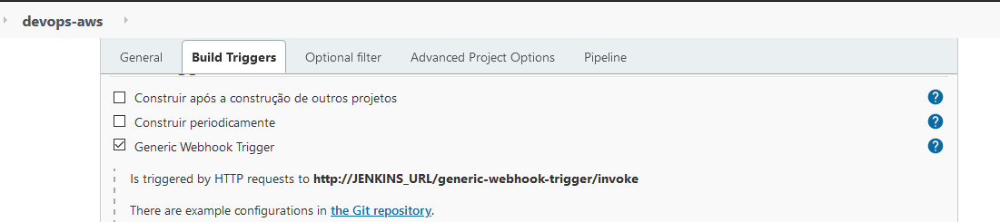

 

# Desafio DevOps - MBA FIAP
- Transformar o chatbot em chatops, fazendo com que o lambda chame o jenkins e realize um deploy de uma EC2

## Requirements on Jenkins Resource
[ x ] - Uma instância EC2 para instalação do Jenkins com `Ansible` instalado e acesso liberado nas portas `8080 (src=any)` e `22 (src=myIpAddress)`

[ x ] - Plugins ``Blue Ocean (all plugins) Webhook Generic ``

[ x ] - Criar um Job com a pipeline conforme o arquivo `Jenkins/jenkins-pipeline`

[ x ] - Configurar a trigger do Job através de um webhook q será enviado pelo serviço `lambda`



[ x ] - Configurar um **Token** para este Webhook


[ x ] - Definir um diretório para clone deste projeto

## Ansible Playbook
Foi criado o playbook `playbooks/deploy-ec2.yaml` para deploy de uma instância EC2 na AWS

## Requirements on AWS
- [Lambda Function](https://console.aws.amazon.com/lambda/) - com runtime `Python 3.6` e com a função conforme arquivo `AWS/lambda_funtion.py`

- [API Gateway](https://console.aws.amazon.com/apigateway/)  com um método POST configurado linkado ao `Lambda`

- [Dynamo DB](https://console.aws.amazon.com/dynamodb/) - Foi criado uma tabela `infrastructure` com 2 items 

| quantity | reource |
| -------- |:-------:|
|    `1`  |  `ec2` |

## Requirements on Dialog Flow
- Criar um novo Agente no [DialogFlow](https://dialogflow.cloud.google.com)

- Criar a intenção para deploy de uma **EC2**
````
name: deploy-ec2
----
Training phrases
Ex:
"quero criar 1 ec2 na aws"
"preciso de 3 instancias ec2 na aws"
"quero 10 ec2"
----
Action and parameters
parameter name: quantidade
entity: @sts.number
value: $quantidade
````
- Ativar o Webhook na seção `Fulfillment`

