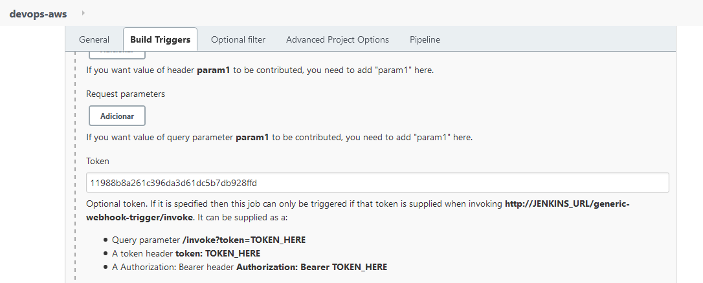

 

# Desafio DevOps - MBA FIAP
- Transformar o chatbot em chatops, fazendo com que o lambda chame o jenkins e realize um deploy de uma EC2

## Requirements on Jenkins Resource
[ x ] - Uma instância EC2 para instalação do Jenkins com `Ansible` instalado

[ x ] - Plugins ``Blue Ocean (all plugins) Webhook Generic ``

[ x ] - Criar um Job com a pipeline conforme o arquivo `jenkins-pipeline`

[ x ] - Configurar a trigger do Job através de um webhook q será enviado pelo serviço `lambda`

[ x ] - Configurar um `Token` para este Webhook

[ x ] - Definir um diretório para clone deste projeto

## Ansible Playbook
Foi criado o playbook `deploy-ec2.yaml` para deploy de uma instância EC2 na AWS

